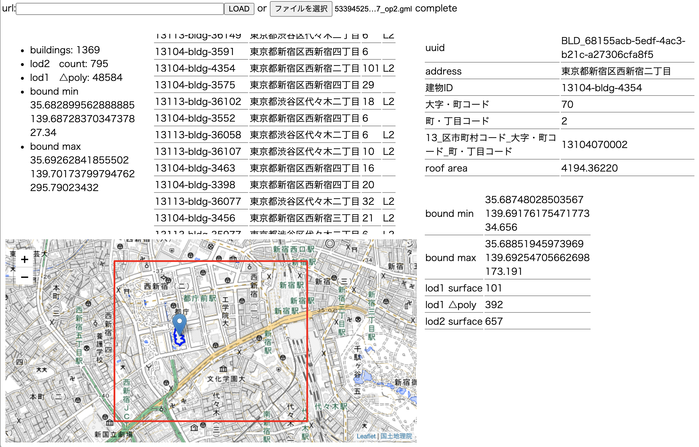

# gmlexp
GML file explorer

[PLATEAU Project](https://www.mlit.go.jp/plateau/) で配布されている CityGMLのファイルを簡易的に閲覧するツールです。 

Webブラウザで動作します。ローカルファイルの.gmlを読み込んで解析します。

[github page](https://www.mlit.go.jp/plateau/)でも使えます。

 - 配布されているCityGMLのうち建物データ(bldg)のみに対応しています。
 - パーサーは手抜きです。全てのgml仕様を満たす物ではありません。

