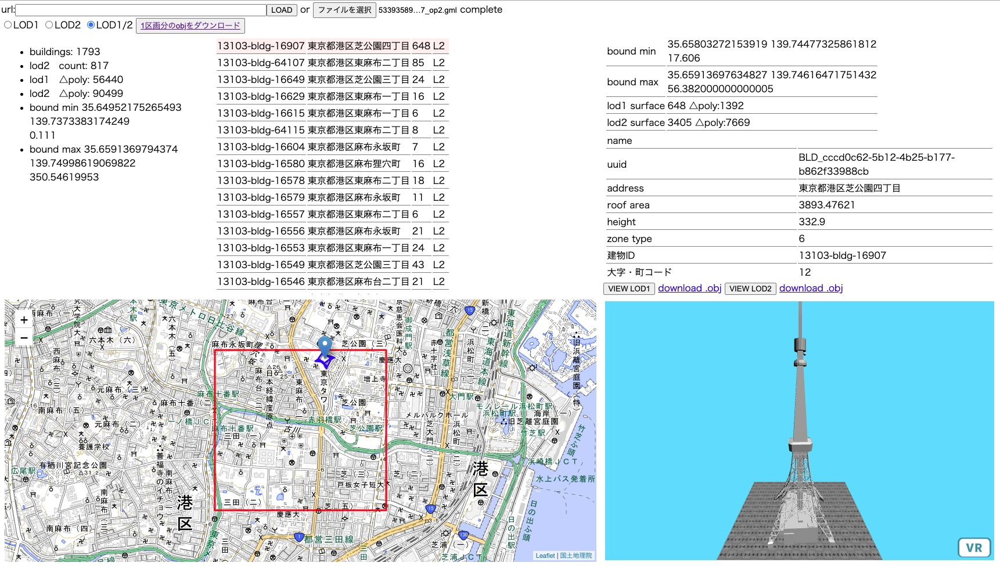

# gmlexp
GML file explorer

[PLATEAU Project](https://www.mlit.go.jp/plateau/) で配布されている CityGMLのファイルを簡易的に閲覧するツールです。 

Webブラウザで動作します。ローカルファイルの.gmlを読み込んで解析します。

## できること

 - gmlファイルを読み込んで、建物ごとの属性データと3Dデータの概要を見られます
 - 建物の位置を地図上にマッピングします
 - LOD1/LOD2の3Dデータをプレビューできます
 - 建物ごと、またはファイル全体の3Dデータを.objファイルとして書き出せます
 - LOD2のテクスチャは未対応です。また、凹ポリゴンの分割をしていません
 - .objファイルはz-upです。またコメントとして建物の位置座標が入っています
 
[github page](https://wakufactory.github.io/gmlexp/index.html)でも使えます。

## できないこと

 - 配布されているCityGMLのうち建物データ(bldg)のみに対応しています。
 - パーサーは手抜きです。全てのgml仕様を満たす物ではありません。
 - このツールを利用したことによるいかなる結果も、ツール作者は責を負わないものとします。

